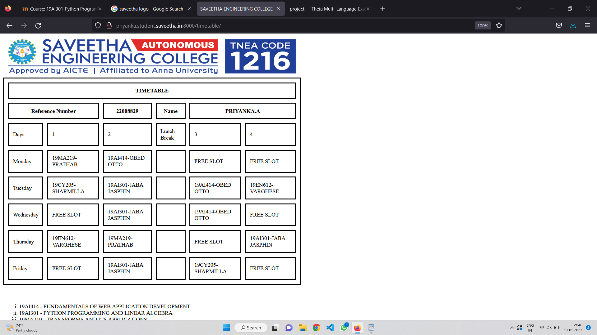

# Experiment_Time_Table

## AIM
To Write a html webpage page to display your timetable.

# ALGORITHM
### STEP 1
create a simple table using table tag
### STEP 2
Add header row using th tag
### STEP 3
Add your timetable
### STEP 4
Execute the program

# CODE
```
<!DOCTYPE html>
<html lang="en">
<head>
  <title>SAVEETHA ENGINEERING COLLEGE </title>
   <style>
    table {
      width: 750px;
      border-spacing: 10px;
      border: 3px solid;
    }

     td, th {
      border: 3px solid;
      padding: 10px;
    }
  </style>
  
</head>
<body>
   
    
   <table> 
    <tr>
      <th colspan="6">TIMETABLE</th>
    </tr>
    <tr>
      <th colspan="2" >Reference Number</th>
      <th>22008829</th>
      <th>Name</th>
      <th colspan="2">PRIYANKA.A</th>
    </tr>
    <tr>
      <td>Days</td>
      <td>1</td>
      <td>2</td>
      <td>Lunch Break</td>
      <td>3</td>
      <td>4</td>
    </tr>
    <tr>
      <td>Monday</td>
      <td>19MA219-PRATHAB</td>
      <td>19AI414-OBED OTTO</td>
      <td></td>
      <td>FREE SLOT</td>
      <td>FREE SLOT</td>
    </tr>
    <tr>
      <td>Tuesday</td>
      <td>19CY205-SHARMILLA</td>
      <td>19AI301-JABA JASPHIN</td>
      <td></td>
      <td>19AI414-OBED OTTO</td>
      <td>19EN612-VARGHESE</td>
    </tr>
    <tr>
      <td>Wednesday</td>
      <td>FREE SLOT</td>
      <td>19AI301-JABA JASPHIN</td>
      <td></td>
      <td>19AI414-OBED OTTO</td>
      <td>FREE SLOT</td>
    </tr>
    <tr>
      <td>Thursday</td>
      <td>19EN612-VARGHESE</td>
      <td>19MA219-PRATHAB</td>
      <td></td>
      <td>FREE SLOT</td>
      <td>19AI301-JABA JASPHIN</td>
    </tr>
    <tr>
      <td>Friday</td>
      <td>FREE SLOT</td>
      <td>19AI301-JABA JASPHIN</td>
      <td></td>
      <td>19CY205-SHARMILLA</td>
      <td>FREE SLOT</td>
    </tr>
  </table>
  <br><br>

  <ol  type="i">
    
      <li>19AI414 - FUNDAMENTALS OF WEB APPLICATION DEVELOPMENT</li>
      <li>19AI301 - PYTHON PROGRAMMING AND LINEAR ALGEBRA</li>
      <li>19MA219 - TRANSFORMS AND ITS APPLICATIONS</li>
      <li>19CY205 - PRINCIPLES OF CHEMISTRY IN ENGINEERING</li>
      <li>19EN612 - GERMAN BASICS</li>
      
  </ol>
</body>
</html>
```

# OUTPUT

